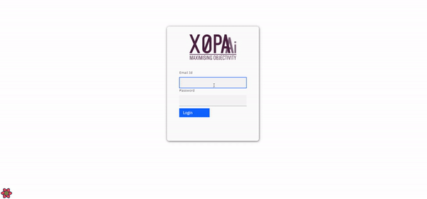
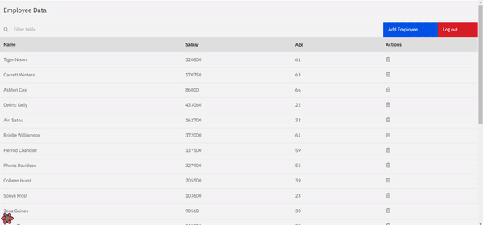
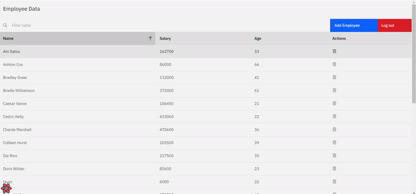
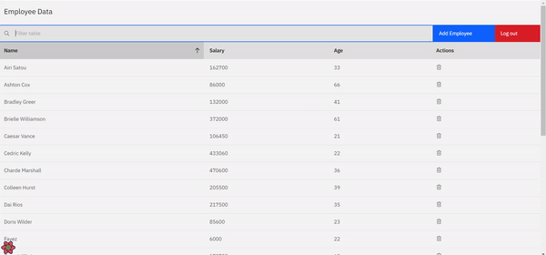
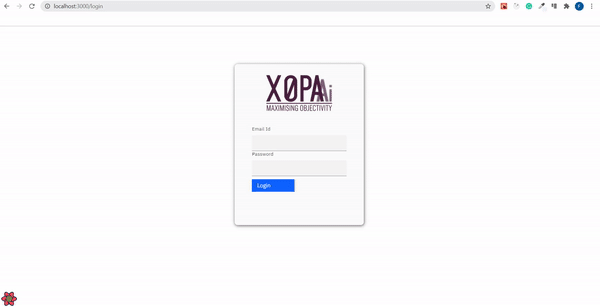

# react-item-list

> Designed and implemented a production ready application for displaying list of items

> Technology used: `React 17`, `Carbon Components React`, `React-Query`

---

## Table of Contents

- [Installation](#installation)
- [BrowserList](#browserlist)

---

## Installation

> To proceed with smooth installation you should have Node 15+ version installed in your system

> Please navigate to project folder folder and run below command to install `node_modules` in order to run this app locally.

```shell
$ npm ci
```

> Once node dependencies are installed then please open your terminal and run `npm start` for a development server.
> Navigate to `http://localhost:3000/`.
> The app will automatically launch if you change any of the source files.

---

## Features

> Expected functionality:

- Login form with username and password
- Using data table component from carbon react components create a table supporting adding a record, deleting a record, and search
  through the records

## Screencast GIF

### 👉🏼 Desktop



---

### 👉🏼 Add Record



---

### 👉🏼 Delete Record



---

### 👉🏼 Search Record



---

### 👉🏼 Not Found Route



---

#### Best user experience can be enjoyed on:

- Google Chrome
- Mozilla Firefox
- Safari
- Microsoft Edge

---
